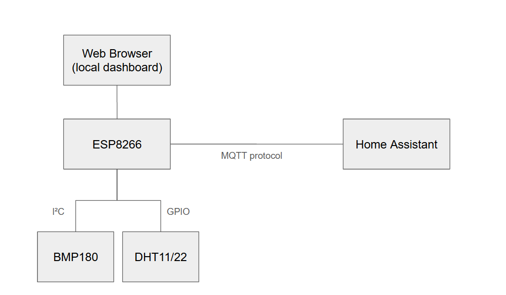

# ESP8266 Weather Station with MQTT and Home Assistant

## Project Overview

This project implements a **home weather station** based on the **ESP8266**, using multiple environmental sensors, publishing data via **MQTT**, and providing local visualization through an **embedded web server**.

The main goal is to **collect environmental data (temperature, humidity, atmospheric pressure, and altitude)** and **periodically send it to Home Assistant** using a local MQTT broker.

In addition to Home Assistant integration, the firmware also exposes a simple HTTP interface for real-time data access.

## Features

* Automatic Wi-Fi connection with reconnection logic
* Environmental sensor readings:
  * Temperature and humidity (DHT11)
  * Higher-precision temperature and humidity (DHT22) - Redundant temperature sensor
  * Atmospheric pressure and altitude (BMP180)
* Periodic data publishing via **MQTT (JSON payload)** every 10 seconds
* Compatible with **Home Assistant MQTT Sensor**
* Asynchronous web server for local monitoring
* Serial logging for debugging

## Sensors Used

* DHT11

* Digital temperature and humidity sensor, it is low cost and low accurac. Usually is used as a basic reference sensor. 
[https://cdn-shop.adafruit.com/datasheets/DHT11-chinese.pdf](https://cdn-shop.adafruit.com/datasheets/DHT11-chinese.pdf)

* DHT22 (AM2302)

Digital temperature and humidity sensor with higher accuracy. It has better stability and wider measurement range. 
[https://cdn-shop.adafruit.com/datasheets/DHT22.pdf](https://cdn-shop.adafruit.com/datasheets/DHT22.pdf)

* BMP180 (Bosch)

Digital barometric pressure sensor. It measures atmospheric pressure and calculates altitude, communicating to the board through I2C communication interface. [https://cdn-shop.adafruit.com/datasheets/BST-BMP180-DS000-09.pdf](https://cdn-shop.adafruit.com/datasheets/BST-BMP180-DS000-09.pdf)

## MQTT Communication

Collected data is published in JSON format to the configured MQTT broker:

* **Broker:** defined by `mqtt_server`
* **Topic:** `casa/sala/sensor` - you might use the topic name as you wish, following MTQTT standards.
* **QoS:** default
* **Retained:** `true`

The example below show a published payload from the board:

```json
{
  "temperature": 24.30,
  "humidity": 61.20,
  "dht22_temperature": 24.10,
  "dht22_humidity": 60.80,
  "pressure": 1012.45,
  "altitude": 32.10
}
```

This format is directly compatible with **Home Assistant MQTT sensors**.

## Embedded Web Server

The ESP8266 exposes a web interface accessible via a browser:

* `/` → HTML page with live sensor data
* `/temperature`
* `/humidity`
* `/pressure`
* `/altitude`

The main page uses **JavaScript + Fetch API** to automatically refresh values every 10 seconds.

## System Architecture

Simplified diagram showing how the project works:




## Update Interval

* Sensor readings and MQTT publishing occur every **10 seconds**
* The use of `millis()` avoids blocking the main loop

## Important Notes

* DHT sensors are sensitive to electrical noise;
* Decoupling capacitors are recommended (100nF + 10µF);
* DHT22 requires a minimum interval between readings (≥ 2 seconds);
* For critical or long-running applications, I2C sensors such as **BME280** or **SHT31** are more reliable, but are not included into this project.

## Future Improvements

* Watchdog-based sensor recovery
* GPIO-controlled power cycling for DHT22
* Home Assistant MQTT auto-discovery
* MQTT over TLS
* Full migration to I2C-based sensors

## License

This project is intended for educational and experimental use. Free to modify and redistribute.


